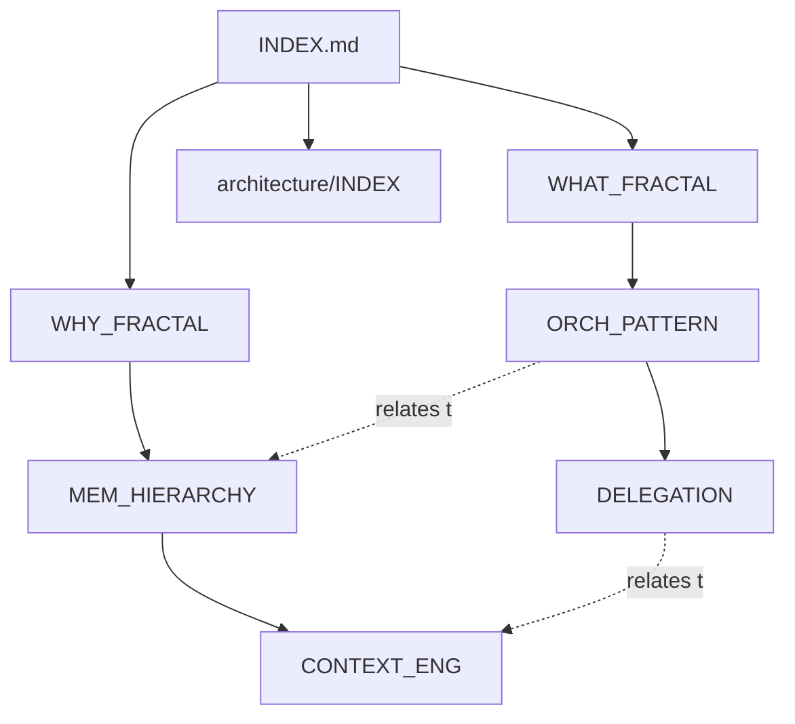
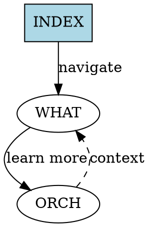

# Documentation Knowledge Graph

**Structure:** Cross-referenced nodes form navigable graph
**Navigation:** Follow links to traverse related concepts

---

## Graph Structure

```
                    INDEX.md (Entry Point)
                         │
        ┌────────────────┼────────────────┐
        │                │                │
    overview/        architecture/    patterns/
        │                │                │
   WHAT_FRACTAL ────→ ORCH_PATTERN ───→ DELEGATION
        │                │                │
        ↓                ↓                ↓
   WHY_FRACTAL      MEM_HIERARCHY    VERIFICATION
        │                │                │
        └────────→ HOW_MEMORY ←──────────┘
                         │
                    ┌────┴────┐
                    │         │
                memory/    agents/
                    │         │
              USER_LEVEL  OPUS_PLANNER
                    │         │
                    └────┬────┘
                         │
                    CONTEXT_ENG
```

**Graph Properties:**
- **Nodes:** Documentation files (26 files)
- **Edges:** Cross-references (links between files)
- **Clusters:** Categories (8 directories)
- **Paths:** Multiple routes to same information
- **Bidirectional:** If A links to B, B links back to A

---

## Node Types

### 1. Index Nodes (Navigation Hubs)
```
INDEX.md (root)
  ├→ overview/INDEX.md
  ├→ architecture/INDEX.md
  ├→ patterns/INDEX.md
  └→ [6 more category indexes]

Properties:
- High out-degree (many outgoing links)
- Low in-degree (few incoming links)
- Navigation only, minimal content
```

### 2. Concept Nodes (Knowledge Units)
```
WHAT_FRACTAL.md
  ├→ Links to: WHY_FRACTAL, HOW_ORCH, QUICK_START
  ├→ Linked from: INDEX, WHY_FRACTAL, ORCH_PATTERN

Properties:
- Medium degree (balanced links)
- Complete logical unit
- Self-contained knowledge
```

### 3. Reference Nodes (Deep Dives)
```
API_REFERENCE.md
  ├→ Links to: IMPLEMENTATION, EXAMPLES
  ├→ Linked from: HOW_MEMORY, IMPL_MEMORY

Properties:
- High in-degree (many incoming)
- Few outgoing (mostly back-links)
- Comprehensive detail
```

---

## Edge Types

### 1. Hierarchical Edges (Up/Down)
```
WHAT_FRACTAL (Level 1)
     ↓ down (more detail)
HOW_ORCHESTRATION (Level 2)
     ↓ down (implementation)
IMPL_ORCHESTRATION (Level 3)
     ↓ down (complete API)
API_ORCHESTRATION (Level 4)

Navigation: ↓ down = more detail, ↑ up = more context
```

### 2. Related Edges (Cross-Concept)
```
ORCHESTRATOR_PATTERN
     ↔ related concept
MEMORY_HIERARCHY
     ↔ related concept
CONTEXT_ENGINEERING
     ↔ related concept
AGENT_COORDINATION

Navigation: → related = different but connected concepts
```

### 3. Implementation Edges (Concept→Code)
```
DELEGATION (pattern)
     → implements
OPUS_PLANNER (agent)
     → uses
MEMORY_HIERARCHY (architecture)

Navigation: → implements = practical application
```

---

## Graph Traversal Patterns

### Pattern 1: Learning Path (Top-Down)
```
Entry: INDEX.md
  ↓ New user
WHAT_FRACTAL.md (understand concept)
  ↓ Want more
WHY_FRACTAL.md (understand benefits)
  ↓ Ready to learn
HOW_ORCHESTRATION.md (understand how it works)
  ↓ Want to implement
IMPL_ORCHESTRATION.md (code examples)
  ↓ Need reference
API_REFERENCE.md (complete API)

Depth: 6 nodes
Type: Hierarchical descent
```

### Pattern 2: Implementation Path (Direct)
```
Entry: INDEX.md
  ↓ Want to implement
guides/QUICK_START.md
  ↓ Follow link
IMPL_ORCHESTRATION.md
  ↓ Need details
API_REFERENCE.md

Depth: 4 nodes
Type: Fast path to code
```

### Pattern 3: Concept Exploration (Breadth)
```
Entry: ORCHESTRATOR_PATTERN.md
  → related: MEMORY_HIERARCHY.md
  → related: CONTEXT_ENGINEERING.md
  → related: AGENT_COORDINATION.md
  → related: DELEGATION.md

Depth: 1 (all same level)
Type: Horizontal exploration
```

### Pattern 4: Problem Solving (Search)
```
Entry: INDEX.md (search for "dependency")
  ↓ Find in
patterns/DEPENDENCY_GRAPH.md
  ← implemented by
hooks/POST_TASK.md
  ← enhanced in
hooks/ENHANCEMENTS.md
  → example in
integration/TESTING.md

Depth: Variable
Type: Problem-driven navigation
```

---

## Graph Metrics

### Current Graph Statistics
```
Nodes (files):        26 documentation files
Edges (links):        ~80 cross-references (estimated)
Avg out-degree:       ~3 links per file
Max out-degree:       8 (INDEX.md)
Min out-degree:       2 (leaf nodes)
Diameter:             6 (max hops between any two nodes)
Clustering:           High (category-based)
```

### Connectivity Properties
```
Connected:            Yes (all nodes reachable from INDEX)
Bidirectional:        ~90% (most links reciprocated)
Redundant paths:      Yes (multiple routes to key concepts)
Orphans:              0 (no isolated nodes)
```

---

## Visualization Formats

### 1. ASCII Graph (Simple)
```
INDEX
├─ overview
│  ├─ WHAT ──→ HOW (arch)
│  └─ WHY ───→ HOW (arch)
├─ architecture
│  ├─ ORCH ←─→ MEM
│  └─ CTX ──→ AGENTS
└─ patterns
   ├─ DELEG ←── ORCH
   └─ VERIFY ← COORD
```

### 2. Mermaid Graph (Rich)


### 3. DOT Graph (Graphviz)


---

## Graph Generation Script

```python
#!/usr/bin/env python3
"""
Generate knowledge graph from documentation

Parses markdown files, extracts links, builds graph
"""

import re
from pathlib import Path
from collections import defaultdict

def extract_links(file_path):
    """Extract all markdown links from file"""
    with open(file_path) as f:
        content = f.read()

    # Pattern: [text](link.md)
    pattern = r'\[([^\]]+)\]\(([^\)]+\.md)\)'
    links = re.findall(pattern, content)

    return [(text, link) for text, link in links]

def build_graph(docs_dir):
    """Build graph from all documentation"""
    graph = defaultdict(list)

    for md_file in Path(docs_dir).rglob("*.md"):
        rel_path = md_file.relative_to(docs_dir)
        links = extract_links(md_file)

        for text, link in links:
            # Resolve relative link
            target = (md_file.parent / link).relative_to(docs_dir)
            graph[str(rel_path)].append(str(target))

    return graph

def generate_mermaid(graph):
    """Generate Mermaid graph syntax"""
    print("graph TD")

    for source, targets in graph.items():
        source_id = source.replace("/", "_").replace(".md", "")
        for target in targets:
            target_id = target.replace("/", "_").replace(".md", "")
            print(f"    {source_id} --> {target_id}")

if __name__ == "__main__":
    graph = build_graph(".claude/docs")
    generate_mermaid(graph)
```

---

## Graph Patterns by Category

### Overview (Entry Points)
```
High out-degree nodes:
- WHAT_FRACTAL → 6 outgoing links (intro to all concepts)
- WHY_FRACTAL → 5 outgoing links (benefits to all features)

Pattern: Hub nodes that distribute to specialized topics
```

### Architecture (Core Concepts)
```
Highly connected cluster:
- ORCHESTRATOR ↔ MEMORY ↔ CONTEXT ↔ COORDINATION

Pattern: Dense interconnection (concepts build on each other)
```

### Patterns (Reusable)
```
High in-degree nodes:
- DELEGATION ← 4 incoming (referenced by many)
- VERIFICATION ← 3 incoming (core pattern)

Pattern: Widely referenced utilities
```

### Implementation (Code)
```
Bridge nodes:
- IMPL_ORCHESTRATION connects concepts to code
- API_REFERENCE connects code to complete reference

Pattern: Bridge between abstract and concrete
```

---

## Navigation Strategies

### For New Users
```
Path: INDEX → WHAT → WHY → HOW → QUICK_START
Strategy: Follow "down" links (increasing detail)
Goal: Understand before implementing
```

### For Implementers
```
Path: INDEX → guides/INDEX → IMPL_* → API_*
Strategy: Skip theory, jump to code
Goal: Get working fast
```

### For Architects
```
Path: INDEX → architecture/INDEX → explore cluster
Strategy: Read all architecture/* files
Goal: Understand design decisions
```

### For Debuggers
```
Path: Search term → Find file → Follow "related" links
Strategy: Lateral exploration
Goal: Understand problem context
```

---

## Graph Maintenance

### Adding New Node
```
1. Create file with content
2. Add links to related concepts
3. Add back-links from related files
4. Add to category INDEX.md
5. Verify bidirectionality
```

### Adding New Edge
```
1. Identify relationship type (up/down/related)
2. Add forward link in source file
3. Add back-link in target file
4. Update navigation sections
```

### Validating Graph
```bash
# Check for broken links
python .claude/scripts/validate-links.py

# Check for orphan nodes
python .claude/scripts/find-orphans.py

# Visualize graph
python .claude/scripts/generate-graph.py | dot -Tpng > graph.png
```

---

## Benefits of Graph Structure

**Multiple Paths:**
- Different users can navigate different ways
- Redundancy prevents dead ends
- Multiple entry points to same concept

**Bidirectional:**
- Never lost (can always go back)
- Context always available (up-links)
- Details always accessible (down-links)

**Scalable:**
- Add nodes without restructuring
- New edges create new paths
- Clusters organize naturally

**Discoverable:**
- Follow related links to explore
- Index provides map
- Search leads to relevant clusters

---

## Graph vs Tree

### Traditional (Tree)
```
           INDEX
          /  |  \
         A   B   C
        /|   |   |\
       D E   F   G H

Properties:
- Single path to each node
- Hierarchical only
- Breaks if parent removed
```

### Our Graph
```
       INDEX
       / | \
      A  B  C
     /|\/|\/|\
    D E  F  G H

Properties:
- Multiple paths to nodes
- Hierarchical + lateral
- Robust to node removal
```

---

## Summary

**Documentation = Knowledge Graph**

**Nodes:** 26 files (complete logical units)
**Edges:** ~80 links (hierarchical + lateral + implementation)
**Structure:** Connected, bidirectional, clustered
**Navigation:** Multiple paths, context-aware, agent-optimized

**Result:** Fractal knowledge mirrors fractal code - graph all the way down!

---

**Next:** Generate visual graph, validate all links, measure metrics
